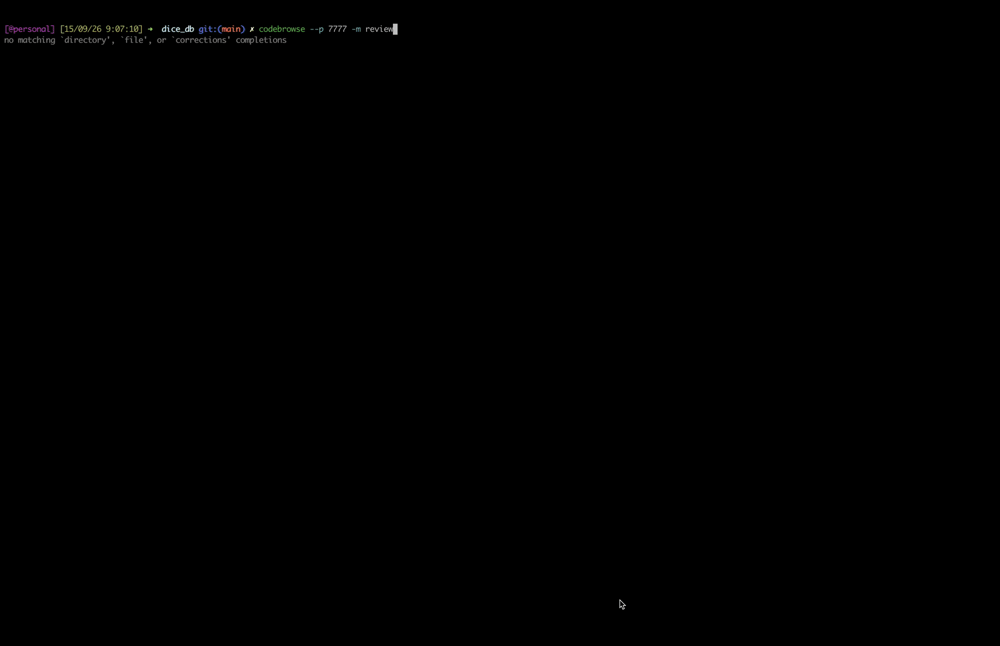

# codebrowse

**A localhost code browser with a coding agent built in.**

More and more code is written by agents in terminals. The hard part is no longer typing the change — it's reviewing it. codebrowse turns your browser into the review surface: diffs, symbol navigation, line comments, and a live pi agent session sitting right next to the code, so you can ask, steer, and verify without leaving the page.

## Demo



*(reviewing a working-tree diff, leaving line comments, discussing them with the agent in the embedded chat)*

## Why

AI didn't just change how code gets written — it changed where developers spend their time. The bottleneck moved to reading: verifying agent output, auditing diffs, navigating unfamiliar code at speed.

Editors were built for writing. PR pages were built for gatekeeping after the fact. Neither fits "the agent just rewrote half this file and I need to understand it *now*."

codebrowse is opinionated about this:

- **Same session as your terminal.** The chat panel attaches to your live `pi` session — the agent knows what it just did; you don't repeat context.
- **Comments where the code is.** Select any line or range in a file or diff, drop a comment, and discuss it with the agent in one click. The comment queue doubles as the agent's todo list.
- **Instant, always.** Single Go binary, vanilla JS, no runtime dependencies, localhost-only by default. Opens in well under a second.

## How it fits in

- **Reviewing AI agent output**: live-refreshing diffs as the agent works (scroll position preserved), status badges, stacked multi-file review in GitHub-PR style.
- **Feature work sidecar**: keep the terminal for the agent, keep codebrowse open to inspect, comment, commit, and push from the UI.
- **Repo archaeology**: structural outline, click-any-identifier call-site popover (xref), and parallel content search across the tree.
- **Markdown/HTML preview**: read repo docs rendered, not raw.

## Installation

Requires Go 1.22+. No npm, node, CGO, or external dependencies.

```bash
git clone https://github.com/stillNovice/codebrowse.git
cd codebrowse
make build
```

Or run straight from source for any repo:

```bash
./serve.sh -r ~/src/some-repo    # builds, (re)starts, prints the URL
```

## Features

- **Live agent chat**: embedded panel wired to a real `pi --mode rpc` session shared with your terminal; resumes the latest session automatically (`-no-attach` for fresh); streaming responses, model picker, stop button.
- **Git-aware review**: working-tree diffs (unstaged/staged), branch-based review mode (`base...ref`) with stacked scroll + scrollspy, status badges (`M`, `A`, `D`, `??`), commit & push from the UI.
- **Line comments**: drag in the gutter to comment on a line range, in files or diffs; discuss-with-agent one click away; comment queue survives restarts (JSONL per repo).
- **Symbol navigation**: Go AST outline + name-based xref — click any identifier to see its call sites, click a site to jump there. Works across files; incremental reindex.
- **Content search**: parallel scan with literal fast-reject (whole-file check before line splitting), regex mode, binary-file skipping, bounded caps.
- **Live refresh over SSE**: agent edits appear while you look at them; viewport and scroll survive re-renders.
- **Self-contained**: one static binary, web assets embedded, no config files, no phone-home.

## Usage

```bash
codebrowse -r ~/src/some-repo          # browse + chat (resumes latest pi session)
codebrowse -r . -p 7777                # specific port
codebrowse -r . -m review              # review mode: diff front and center
codebrowse -r . -no-attach             # fresh agent session
codebrowse -r . -no-chat               # no agent panel; comments still work
```

### CLI Flags

| Flag | Short | Default | Description |
| --- | --- | --- | --- |
| `-repo` | `-r` | `.` | repository root to browse |
| `-port` | `-p` | `4004` | listen port; if busy, next 20 ports are probed |
| `-host` | | `127.0.0.1` | bind address (localhost-only by default) |
| `-mode` | `-m` | | `review` or `build` launch mode |
| `-attach` | | `true` | resume the most recent pi session for this repo |
| `-no-attach` | | | start a fresh pi session |
| `-session` | | | resume a specific pi session (path or id) |
| `-open` | | | file to open on load (repo-relative) |
| `-no-chat` | | | disable the agent chat panel |
| `-chat` | | | deprecated: chat is on by default; ignored |

## Keyboard & Mouse

| Action | How |
| --- | --- |
| Filter files | type in the left search box |
| Content search | press `/` in the search box, then query; `/regex/` for regex |
| Comment on a line | click the gutter line number (drag for a range) |
| Call sites of a symbol | click the identifier (Go/JS) |
| Markdown ↔ source | `</>` / `▤` buttons on markdown files |
| Reveal repo path | hover or click the repo name in the header |
| Commit message from comments | collect button in the comments panel |

## Why not an IDE or a PR page?

| | Traditional IDE (VS Code) | PR page (GitHub) | codebrowse |
| --- | --- | --- | --- |
| Built for | writing code | gating merges after the fact | reviewing working code, live |
| Agent context | none (separate chat tools) | none | the terminal agent's own session |
| Line comments | via extensions | after PR exists | instant, pre-PR, pre-commit |
| Weight | ~1.4 GB, 15+ processes | fine, but post-hoc only | single binary, ~20 MB, <1 s open |
| Shows uncommitted work | yes | no | that's the default view |

## Architecture & Internals

Single Go binary; the UI is vanilla JS served from embedded assets.

```
main.go                  flags, bootstrap, xref warm-up
internal/
  server/                HTTP API, SSE watcher, search, static embedding
  piagent/               pi --mode rpc session lifecycle (primary chat)
  piconfig/              pi config: models, endpoints, $ENV refs
  agent/                 direct OpenAI-compatible fallback client
  comments/              comment queue (JSONL per repo)
  gitx/                  git shell-out, fixed argv, porcelain v2
  symbols/               per-file outline (Go AST + regex families)
  xref/                  name-based call-site index (Go AST + JS scanner)
```

Deep-dives: [docs/architecture.md](docs/architecture.md) · API reference: [docs/api.md](docs/api.md) · build/release: [docs/building.md](docs/building.md) · security model: [docs/security.md](docs/security.md)

## Security & Privacy

- Binds `127.0.0.1` by default; never exposed unless you say so.
- No accounts, no telemetry, no phone-home. Code and prompts stay on your machine.
- Credentials via environment only; nothing sensitive in logs (no full paths, no PII).
- All subprocess calls are fixed argv; client paths/refs validated before use. Details in [docs/security.md](docs/security.md).

## Contributing

Agent- and human-friendly: see [AGENTS.md](AGENTS.md) for repo rules (stdlib-only, fixed argv, temp-dir-only tests) and run:

```bash
make check    # gofmt + vet + tests + JS syntax gate
```

## License

[MIT](LICENSE) · **[codebrowse.live](https://stillnovice.github.io/codebrowse/)** — demo + install.
